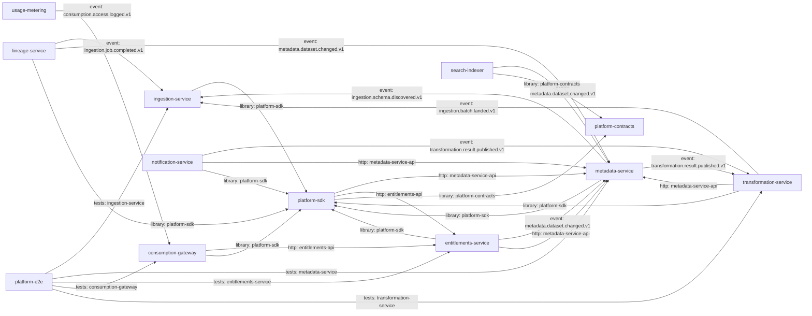

# Dependency graph (generated from catalog)

Synthetic example. An arrow `A --> B` means A depends on B.

```mermaid
graph LR
  ingestion-service -->|library: platform-sdk| platform-sdk
  metadata-service -->|event: ingestion.schema.discovered.v1| ingestion-service
  metadata-service -->|event: transformation.result.published.v1| transformation-service
  metadata-service -->|library: platform-sdk| platform-sdk
  entitlements-service -->|event: metadata.dataset.changed.v1| metadata-service
  entitlements-service -->|http: metadata-service-api| metadata-service
  entitlements-service -->|library: platform-sdk| platform-sdk
  consumption-gateway -->|http: entitlements-api| entitlements-service
  consumption-gateway -->|library: platform-sdk| platform-sdk
  transformation-service -->|event: ingestion.batch.landed.v1| ingestion-service
  transformation-service -->|http: metadata-service-api| metadata-service
  transformation-service -->|library: platform-sdk| platform-sdk
  search-indexer -->|event: metadata.dataset.changed.v1| metadata-service
  search-indexer -->|library: platform-contracts| platform-contracts
  lineage-service -->|event: ingestion.job.completed.v1| ingestion-service
  lineage-service -->|event: metadata.dataset.changed.v1| metadata-service
  lineage-service -->|library: platform-sdk| platform-sdk
  notification-service -->|event: transformation.result.published.v1| transformation-service
  notification-service -->|http: metadata-service-api| metadata-service
  notification-service -->|library: platform-sdk| platform-sdk
  usage-metering -->|event: consumption.access.logged.v1| consumption-gateway
  platform-sdk -->|http: metadata-service-api| metadata-service
  platform-sdk -->|http: entitlements-api| entitlements-service
  platform-sdk -->|library: platform-contracts| platform-contracts
  platform-e2e -->|tests: ingestion-service| ingestion-service
  platform-e2e -->|tests: metadata-service| metadata-service
  platform-e2e -->|tests: entitlements-service| entitlements-service
  platform-e2e -->|tests: consumption-gateway| consumption-gateway
  platform-e2e -->|tests: transformation-service| transformation-service
```
